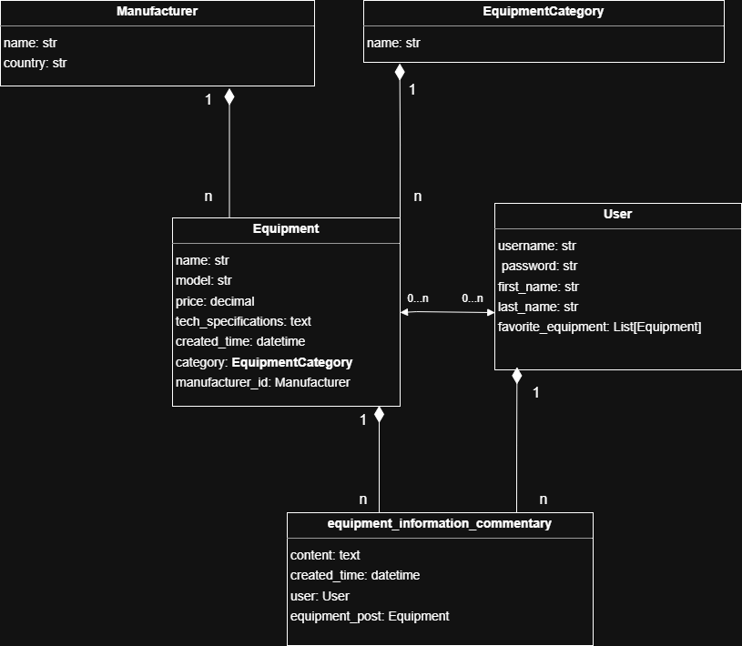

# Equipment information for users

- This is a web app where you can post and view posts about 
technology and its specifications, as well as leave or view 
comments
- The site allows you to add items to your favorites and view other users' favorites lists
- The models for this project were implemented using the following logic:
  
- 
- The website features a custom interface built using the Django Soft UI Design template
- The website has the following pages:
- Home Page, with navigation to the available pages of the site 

- Equipment List Page

- A product description page that includes technical specifications and user reviews. 
On this page, you can also add or remove this product from your favorites list.

- Creating a new item on the website

- Manufacturer List Page and creating a new manufacturer, 
all pages containing lists have page navigation and filtered search enabled

- Equipment Categories Page. Users can edit or delete items from the list

- A list of all registered users on the site. By clicking on the star next to a selected user, 
you can view their favorites list.

- Favorites List Page. If the list belongs to a logged-in user, they can remove items from the list

- User creation Page

- User information update page

